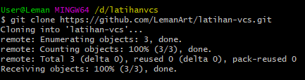
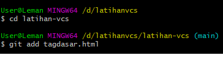
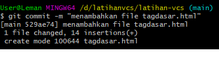

# latihan-vcs

## Cara menggunakan git

### Membuat folder
buat folder di localdisk:D

### buka gitbash lalu pindahkan ke folder d/latihanvcs
pindahkan ke disk D:latihanvcs dengan cara "cd /d/latihanvcs", kemudian lakukan git clone

### Masuk repository lalu tambahkan file html

### Buat commit atas file yang ditambahkan
