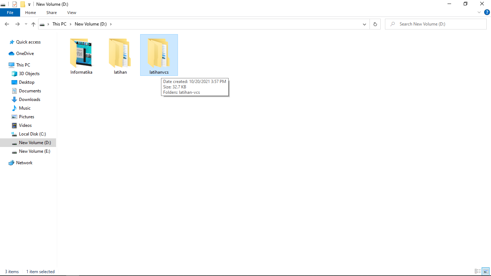

# latihan-vcs

## Cara menggunakan git

### Membuat folder
buat folder di localdisk:D

### buka gitbash lalu pindahkan ke folder d/latihanvcs
pindahkan ke disk D:latihanvcs dengan cara "cd /d/latihanvcs"
buat folder di localdisk:D
